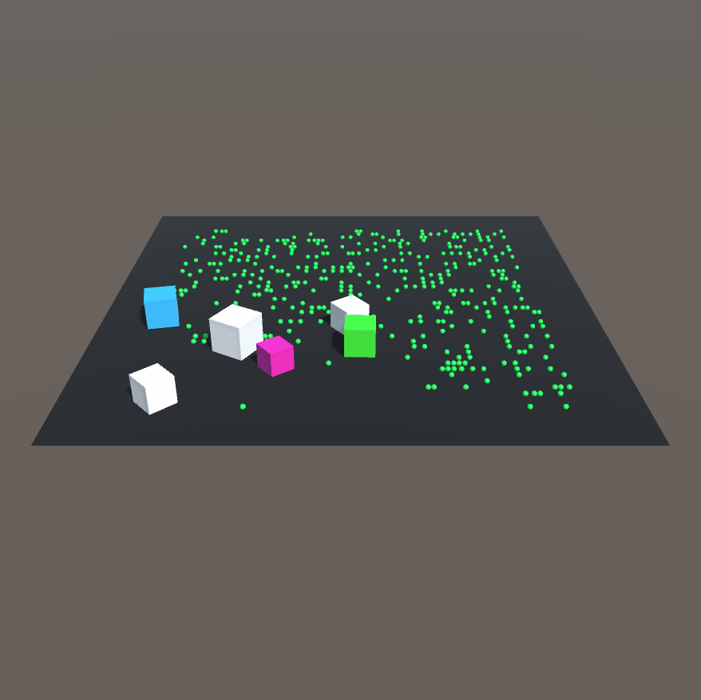

# cubevolution
A light weight evolution simulation in unity using C# and Unity. The C# files in the repository lay out the rules for the simulation: cubes will die if they don't get enough food, every time a cube gains food it grows larger and faster (therefore increasing its ability to get more food) and once all the food is gone bigger cubes begin to eat smaller cubes. 

These three simple rules mimic natural selection. 

### Next steps:

The next two objectives in this project are to introduce reproduction (so evolution over more then one generation can be displayed) and introduce a UI so the user can tweak parameters like random starting locations, food stress and each cube's sight ability. 
